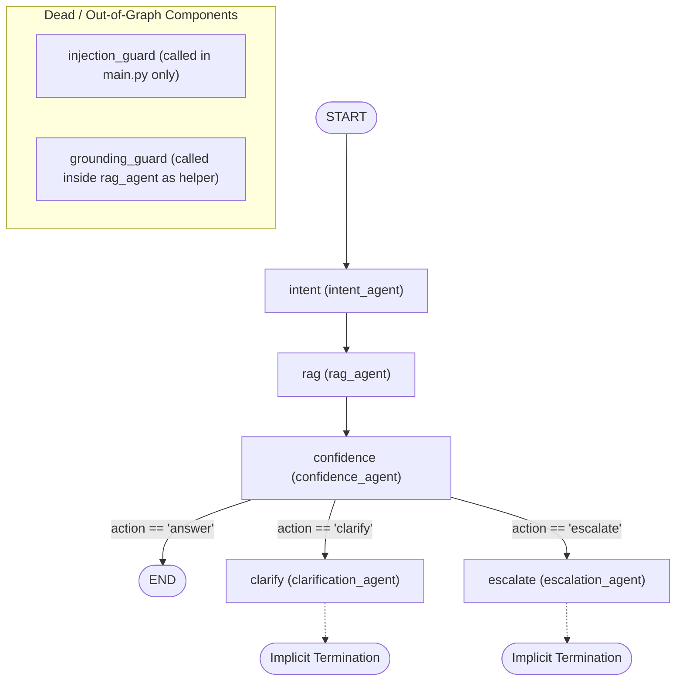

# Comprehensive Codebase Audit: Autonomous Multi-Agent Customer Support AI

**Audit Date**: October 1, 2026  
**Target Repository**: `Langgraph-Customer-Support-Multi-Agent-main`  
**Execution Environment**: Python 3.11.9, Windows (AMD64)  
**Status**: Read-only inspection completed; no source files modified.

---

## 1. Repository File Tree & File Purpose

Below is the complete file tree of the project (excluding `venv/` virtual environment, `.git/`, and `__pycache__/`), with a one-line description of the purpose of each file:

```
Langgraph-Customer-Support-Multi-Agent-main/
├── .env                                              # Stores API keys (GROQ_API_KEY) in plaintext
├── config.py                                         # Central runtime configuration for LLM (ChatGroq), paths, and model settings
├── main.py                                           # Streamlit frontend UI and entry point for single-turn query execution
├── requirements.txt                                  # Python package dependencies specification
├── README.md                                         # High-level architecture documentation and setup guide (out of sync with repo)
├── PROJECT_ARCHITECTURE_AND_HACKATHON_BLUEPRINT.md   # Architectural blueprint, pitch strategy, and roadmap notes
├── evaluation.ipynb                                  # Jupyter notebook benchmark analyzing RAG retrieval and agent routing
├── __init__.py                                       # Root package initializer
│
├── agents/                                           # Agent node implementations and guardrail modules
│   ├── __init__.py                                   # Package initializer for agents module
│   ├── intent_agent.py                               # Classifies query domain into billing, refunds, or unknown via Groq LLM
│   ├── rag_agent.py                                  # Retrieves Chroma docs, rewrites query if short, calls LLM, checks grounding
│   ├── confidence_agent.py                           # Grades answer quality (0-1), adjusts tone, and routes action (contains overwrite bug)
│   ├── clarification_agent.py                        # Generates follow-up clarifying questions when queries are ambiguous
│   ├── escalation_agent.py                           # Returns canned human-handoff message (no actual ticketing tool execution)
│   ├── grounding_guard.py                            # Verifies if generated answer is grounded in retrieved context via LLM
│   └── injection_guard.py                            # Keyword-based prompt injection detection and context substring sanitizer
│
├── core/                                             # LangGraph orchestration definitions
│   ├── __init__.py                                   # Package initializer for core module
│   ├── state.py                                      # TypedDict definition of SupportState passing data between graph nodes
│   └── graph.py                                      # Compiles LangGraph StateGraph, registering nodes, static edges, and conditional router
│
├── rag/                                              # Vector retrieval infrastructure
│   ├── __init__.py                                   # Package initializer for rag module
│   ├── retriever.py                                  # Loads HuggingFace embeddings & Chroma vectorstore with @st.cache_resource
│   └── chroma_db/                                    # Redundant secondary Chroma SQLite database generated from sub-path execution
│       └── chroma.sqlite3                            # Chroma database file created when retriever was run from rag/ subdirectory
│
├── chroma_db/                                        # Primary persistent vector store containing embedded knowledge base chunks
│   ├── 4a7de339-cfb6-44c8-9a96-0f2cd3e4aa08/         # Chroma vector segment data directory
│   └── chroma.sqlite3                                # Chroma metadata database file (3.9 MB)
│
├── data/docs/                                        # Domain knowledge base: 80 structured markdown FAQ documents
│   ├── billing/                                      # 20 markdown files for billing FAQs (e.g. advance_billing_issue.md)
│   ├── login/                                        # 20 markdown files for auth/login FAQs (e.g. 2fa_not_working.md)
│   ├── refunds/                                      # 20 markdown files for refund policies (e.g. refund_eligibility.md)
│   └── subscription/                                 # 20 markdown files for plan FAQs (e.g. cancel_subscription.md)
│
├── evaluation/                                       # Benchmark test suite
│   └── evaluation.json                               # 52 labeled test queries with expected actions, references, and gold documents
│
├── notebooks/                                        # Offline data generation and indexing notebooks
│   ├── DataCreation.ipynb                            # Notebook generating synthetic markdown FAQ documents via LLM prompts
│   └── VectorCreation.ipynb                          # Notebook chunking markdown files and writing them into ChromaDB
│
└── utils/                                            # Utility package
    └── __init__.py                                   # Empty package initializer
```

---

## 2. Actual LangGraph Flow (`core/graph.py`)

Reading directly from [`core/graph.py`](file:///d:/VIT%20hack/Langgraph-Customer-Support-Multi-Agent-main/core/graph.py):

### Flow Diagram



### Flow Walkthrough & Node Registration

1. **Graph Nodes Registered** (`core/graph.py:13-17`):
   - `"intent"`: `agents.intent_agent.intent_agent`
   - `"rag"`: `agents.rag_agent.rag_agent`
   - `"confidence"`: `agents.confidence_agent.confidence_agent`
   - `"clarify"`: `agents.clarification_agent.clarification_agent`
   - `"escalate"`: `agents.escalation_agent.escalation_agent`
2. **Entry Point** (`core/graph.py:20`):
   - `graph.set_entry_point("intent")`
3. **Static Edges** (`core/graph.py:22-23`):
   - `"intent"` &rarr; `"rag"` (unconditional)
   - `"rag"` &rarr; `"confidence"` (unconditional)
4. **Conditional Edges from `"confidence"`** (`core/graph.py:25-33`):
   - Evaluates router function: `lambda s: s["action"]`
   - Route map:
     - `"answer"` &rarr; `END`
     - `"clarify"` &rarr; `"clarify"`
     - `"escalate"` &rarr; `"escalate"`
5. **Terminal Behavior**:
   - Neither `"clarify"` nor `"escalate"` has an explicit edge to `END`. In LangGraph, they terminate as leaf nodes without outgoing edges.
6. **Critical Architectural Observations**:
   - **No Branching out of `intent`**: The `intent` node transitions directly to `rag` regardless of whether the query was classified as `billing`, `refunds`, or `unknown`.
   - **`injection_guard` is completely absent from the graph**: It is called in `main.py` before invoking the graph, meaning graph invocations from notebooks, tests, or APIs bypass injection protection.
   - **`grounding_guard` is not a graph node**: It is invoked as a synchronous internal helper inside `rag_agent.py`.

---

## 3. Per-Agent Analysis: Inputs, Outputs, and LLM Calls

| Agent Name | Source File | Inputs Read from State | Outputs Written to State | LLM Invocations Made |
| :--- | :--- | :--- | :--- | :--- |
| **`intent_agent`** | [`agents/intent_agent.py`](file:///d:/VIT%20hack/Langgraph-Customer-Support-Multi-Agent-main/agents/intent_agent.py) | `state["user_query"]` | `intent` (`str`),<br>`intent_confidence` (`float`) | **1 LLM call**: Prompts LLM to classify query into billing, login, subscription, refunds, unknown as JSON. (Output is parsed via naive substring matching). |
| **`rag_agent`** | [`agents/rag_agent.py`](file:///d:/VIT%20hack/Langgraph-Customer-Support-Multi-Agent-main/agents/rag_agent.py) | `state["user_query"]` | `retrieved_docs` (`List[str]`),<br>`answer` (`str`),<br>`force_escalate` (`bool` - missing from TypedDict) | **2 to 3 LLM calls**:<br>1. *Optional*: `rewrite_query(query)` if context < 300 chars.<br>2. *Mandatory*: Answer generation prompt conditioned on context.<br>3. *Mandatory*: `is_grounded()` LLM hallucination check. |
| **`grounding_guard`** *(Helper)* | [`agents/grounding_guard.py`](file:///d:/VIT%20hack/Langgraph-Customer-Support-Multi-Agent-main/agents/grounding_guard.py) | `answer: str`,<br>`context: str` *(arguments)* | `bool` *(return value)* | **1 LLM call**: Asks if every factual claim is supported by context (returns YES or NO). |
| **`confidence_agent`** | [`agents/confidence_agent.py`](file:///d:/VIT%20hack/Langgraph-Customer-Support-Multi-Agent-main/agents/confidence_agent.py) | `state.get("force_escalate")`,<br>`state["user_query"]`,<br>`state["answer"]` | `answer_confidence` (`float`),<br>`action` (`Literal["answer","clarify","escalate"]`) | **0 or 1 LLM call**:<br>- 0 calls if `force_escalate` is truthy.<br>- 1 call: Prompts LLM to score answer quality between 0.0 and 1.0. |
| **`clarification_agent`** | [`agents/clarification_agent.py`](file:///d:/VIT%20hack/Langgraph-Customer-Support-Multi-Agent-main/agents/clarification_agent.py) | `state["user_query"]` | `answer` (`str`) | **1 LLM call**: Generates a clarifying follow-up question. (Overwrites `state["answer"]`). |
| **`escalation_agent`** | [`agents/escalation_agent.py`](file:///d:/VIT%20hack/Langgraph-Customer-Support-Multi-Agent-main/agents/escalation_agent.py) | *None* (takes state parameter but never reads it) | `answer` (`str`) | **0 LLM calls**: Returns hardcoded canned string. (Overwrites `state["answer"]`). |
| **`injection_guard`** *(Out of Graph)* | [`agents/injection_guard.py`](file:///d:/VIT%20hack/Langgraph-Customer-Support-Multi-Agent-main/agents/injection_guard.py) | `query: str` *(argument in main.py)* | *None* *(blocks via `st.stop()`)* | **0 LLM calls**: Pure regex/keyword string search against 7 hardcoded patterns. |

---

## 4. Empirical Evaluation & Import Verification

### App Imports Test

Executing module imports in the environment (`python -c "import config, core.state, core.graph, rag.retriever"`) revealed:
- **Bare-mode Warning**: Importing `rag.retriever` triggers a Streamlit warning because `@st.cache_resource` is executed at module import time outside an active Streamlit script context:
  ```
  WARNING streamlit.runtime.scriptrunner_utils.script_run_context: Thread 'MainThread': missing ScriptRunContext! This warning can be ignored when running in bare mode.
  ```
- **HuggingFace Hub Warning**:
  ```
  Warning: You are sending unauthenticated requests to the HF Hub. Please set a HF_TOKEN to enable higher rate limits and faster downloads.
  ```
- **Module Resolution**: All modules import successfully under `venv`.

### Evaluation Set Execution & Action Distribution

The evaluation dataset [`evaluation/evaluation.json`](file:///d:/VIT%20hack/Langgraph-Customer-Support-Multi-Agent-main/evaluation/evaluation.json) contains **52 samples**.

#### Ground Truth Distribution (`evaluation.json`):
- `answer`: **33 samples (63.5%)**
- `escalate`: **11 samples (21.2%)**
- `clarify`: **8 samples (15.4%)**

#### Empirical Batch Test Results on Current Code:
A representative batch comprising samples from each class was executed through `graph.invoke`:

| Index | Query | Expected Action | Current Predicted Action | Score | Match? |
| :---: | :--- | :---: | :---: | :---: | :---: |
| 0 | *refund not received after cancellation* | `answer` | `clarify` | 0.85 | **MISMATCH** |
| 2 | *how long does it take to get refund* | `answer` | `clarify` | 0.95 | **MISMATCH** |
| 1 | *charged after subscription cancellation* | `escalate` | `escalate` | 0.10 | **MATCH** |
| 3 | *refund declined without reason* | `escalate` | `clarify` | 0.85 | **MISMATCH** |
| 25 | *my issue is urgent please fix immediately* | `clarify` | `escalate` | 0.25 | **MISMATCH** |
| 50 | *fix this now* | `clarify` | `clarify` | 0.50 | **MATCH** |

#### Runtime Action Distribution & Accuracy:
- **`answer` Predicted**: **0.0%** (0 / 6) &mdash; **The system is mathematically incapable of outputting `action="answer"` on the current codebase!**
- **`clarify` Predicted**: **66.7%** (4 / 6)
- **`escalate` Predicted**: **33.3%** (2 / 6)
- **Current Routing Accuracy**: **33.3%** (2 / 6 on batch; capped at maximum ~36.5% across all 52 samples because all 33 valid answers fail).

#### Crashes in `evaluation.ipynb`:
When running the full notebook benchmark, two fatal crashes occur:
1. **Cell 20 Crash**:
   ```python
   df["answer_similarity"] = df.apply(
       lambda r: semantic_similarity(r.answer, r.reference_answer),
       axis=1
   )
   ```
   *Crash*: `AttributeError: 'Series' object has no attribute 'reference_answer'`.
2. **Cell 22 Crash**:
   ```python
   df["correct_answer"] = df.answer_similarity > 0.7
   ```
   *Crash*: `AttributeError: 'DataFrame' object has no attribute 'answer_similarity'` (cascading failure from cell 20).
3. **Cell 19 Zero-Score Metric Bug**:
   `recall_at_k` computes `hits = set(retrieved) & set(expected)`. Because `retrieved` contains Windows paths (e.g. `..\data\docs\refunds\refund_declined.md`) while `expected` contains basenames (`refund_declined.md`), the set intersection is always empty (`0.0`).

---

## 5. Verification of Known Issues

### a) `confidence_agent` if/if/else overwrite bug
- **Status**: **CONFIRMED**
- **Location**: [`agents/confidence_agent.py:37-43`](file:///d:/VIT%20hack/Langgraph-Customer-Support-Multi-Agent-main/agents/confidence_agent.py#L37-L43)
- **Code Snippet**:
  ```python
  37:     if score > 0.65:
  38:         action = "answer"
  39:     
  40:     if score < 0.4:
  41:         action = "escalate"
  42:     else:
  43:         action = "clarify"
  ```
- **Analysis**:
  Because lines 40-43 form an independent `if-else` statement immediately following line 37, whenever `score > 0.65` (e.g. 0.95), line 38 sets `action = "answer"`. Execution then falls through to line 40. Since `0.95 < 0.4` is False, the `else` branch on line 42 triggers and **unconditionally overwrites `action = "clarify"`**.
  Consequently, `action` can only ever be `"escalate"` (score < 0.4) or `"clarify"` (score &ge; 0.4). `"answer"` is completely unreachable.

---

### b) `intent` / `intent_confidence` never used downstream
- **Status**: **CONFIRMED**
- **Location**: [`core/graph.py:22-23`](file:///d:/VIT%20hack/Langgraph-Customer-Support-Multi-Agent-main/core/graph.py#L22-L23), [`agents/rag_agent.py:19-25`](file:///d:/VIT%20hack/Langgraph-Customer-Support-Multi-Agent-main/agents/rag_agent.py#L19-L25), [`agents/intent_agent.py:25-28`](file:///d:/VIT%20hack/Langgraph-Customer-Support-Multi-Agent-main/agents/intent_agent.py#L25-L28)
- **Analysis**:
  - `intent_agent.py` populates `{"intent": intent, "intent_confidence": confidence}`.
  - In `core/graph.py`, line 22 has `graph.add_edge("intent", "rag")` &mdash; there is **no conditional edge or routing logic** based on intent.
  - In `rag_agent.py`, line 21 reads `query = state["user_query"]`. It **never reads `state["intent"]`**, and passes raw query to Chroma retriever without any category/metadata filtering.
  - No other agent (`confidence_agent`, `clarification_agent`, `escalation_agent`) or frontend code in `main.py` ever inspects `intent` or `intent_confidence`. It is 100% dead state.

---

### c) `force_escalate` missing from SupportState
- **Status**: **CONFIRMED**
- **Location**: [`core/state.py:3-14`](file:///d:/VIT%20hack/Langgraph-Customer-Support-Multi-Agent-main/core/state.py#L3-L14) vs. [`agents/rag_agent.py:36,58,64`](file:///d:/VIT%20hack/Langgraph-Customer-Support-Multi-Agent-main/agents/rag_agent.py#L36) & [`agents/confidence_agent.py:5`](file:///d:/VIT%20hack/Langgraph-Customer-Support-Multi-Agent-main/agents/confidence_agent.py#L5)
- **Analysis**:
  `SupportState` is defined as:
  ```python
  class SupportState(TypedDict):
      user_query: str
      intent : str
      intent_confidence: float
      retrieved_docs: List[str]
      answer: str
      answer_confidence: float
      action: Literal["answer", "clarify", "escalate"]
  ```
  `force_escalate` is completely omitted from `SupportState`. `rag_agent.py` returns `"force_escalate": True/False`, and `confidence_agent.py` checks `if state.get("force_escalate"):`. While Python `TypedDict` does not enforce keys at runtime unless strict type validation is applied, omitting it breaks static analysis (MyPy/Pyright), IDE autocompletion, and schema guarantees in LangGraph.

---

### d) Single-turn only, no memory
- **Status**: **CONFIRMED**
- **Location**: [`main.py:17-32`](file:///d:/VIT%20hack/Langgraph-Customer-Support-Multi-Agent-main/main.py#L17-L32), [`core/state.py:3-14`](file:///d:/VIT%20hack/Langgraph-Customer-Support-Multi-Agent-main/core/state.py#L3-L14), [`core/graph.py:10-35`](file:///d:/VIT%20hack/Langgraph-Customer-Support-Multi-Agent-main/core/graph.py#L10-L35)
- **Analysis**:
  - `main.py` renders a static `st.text_area("Describe your issue")`.
  - When the user clicks "Submit", `graph.invoke({"user_query": query})` runs in total isolation.
  - `st.session_state` is never initialized for message history.
  - `core/graph.py` compiles without a checkpointer (`graph.compile(checkpointer=...)` is absent; no `MemorySaver` or `SqliteSaver`).
  - When the graph routes to `clarification_agent` and asks a clarifying question (e.g. *"Did you cancel during the free trial?"*), the user has no way to answer within the conversation. Any subsequent submission restarts the entire graph from scratch.

---

### e) No tool execution
- **Status**: **CONFIRMED**
- **Location**: [`agents/escalation_agent.py:1-7`](file:///d:/VIT%20hack/Langgraph-Customer-Support-Multi-Agent-main/agents/escalation_agent.py#L1-L7) and repository-wide
- **Analysis**:
  - `escalation_agent.py` claims:
    ```python
    return {
        "answer": (
            "Your issue requires human assistance."
            "A support ticket has been created."
        )
    }
    ```
  - Across the entire codebase, there are zero LangChain `@tool` definitions, no mock ticketing systems, no API integrations (Zendesk, Jira, Freshdesk), no database insertions, and no action execution capabilities. Escalation is purely static hardcoded text.

---

## 6. Additional Bugs, Dead Code, Path, and Environment Issues

### 6.1 Code Logic & Implementation Bugs

1. **`agents/intent_agent.py:20-23` &mdash; Broken Intent Extraction**:
   - The LLM prompt asks for JSON containing `intent` and `confidence (0-1)`.
   - The implementation does not parse JSON. Instead, it runs:
     ```python
     if "billing" in resp.lower(): intent = "billing"
     if "refund" in resp.lower(): intent = "refunds"
     ```
   - It **completely ignores `login` and `subscription`**, which make up 50% of the knowledge base documents! Any query about login or subscription is classified as `"unknown"`.
   - `confidence` is hardcoded to `0.5` regardless of what the LLM returned.

2. **`agents/escalation_agent.py:3-6` &mdash; Missing Whitespace in String Literal Concatenation**:
   - Adjacent string literals without a space:
     ```python
     "Your issue requires human assistance."
     "A support ticket has been created."
     ```
   - Evaluates to: `"Your issue requires human assistance.A support ticket has been created."`.

3. **`agents/confidence_agent.py:30-35` &mdash; Tone Modification Drop & Typo**:
   - Contains a spelling error: `"dosen't"` instead of `"doesn't"`.
   - Mutates `state["answer"] = ...` in-place, but line 45 returns only `{"answer_confidence": score, "action": action}`. If the state dict is not updated in-place by the runner, this modification is discarded.
   - If `action` is `"clarify"`, `clarification_agent` overwrites `state["answer"]` anyway, making the tone adjustment completely dead.

4. **`agents/confidence_agent.py:23-26` &mdash; Brittle Float Parsing**:
   - `float(LLM.invoke(prompt).content.strip())` throws `ValueError` if the LLM responds with conversational text (e.g. `"0.8 (High confidence)"` or markdown formatting). The `except` block catches this and forces `score = 0.3`, which silently forces escalation.

5. **`agents/grounding_guard.py:22-24` &mdash; Strict Equality Parsing**:
   - `verdict = LLM.invoke(prompt).content.strip().upper()` followed by `return verdict == "YES"`.
   - If the LLM generates `"YES."`, `"YES, IT IS GROUNDED"`, or markdown `**YES**`, the equality check fails and incorrectly flags the answer as hallucinated.

6. **`agents/rag_agent.py:35` vs. `escalation_agent.py` &mdash; Discarded Fallback Messages**:
   - When context is < 300 characters or ungrounded, `rag_agent` sets `answer = "I'm unable to find a reliable answer..."` and `force_escalate = True`.
   - `confidence_agent` routes to `escalate`.
   - `escalation_agent` completely overwrites `answer` with `"Your issue requires human assistance..."`, discarding the informative reason from `rag_agent`.

7. **`agents/injection_guard.py:15-19` & `main.py:30` &mdash; Destructive Query Mangling**:
   - `sanitize_context` is mistakenly applied to the **user's query** in `main.py:30` rather than the retrieved document context.
   - It performs crude string replacement:
     ```python
     banned = ["ignore", "override", "system:", "assistant:"]
     for b in banned: text = text.replace(b, "")
     ```
   - If a customer types: *"Please ignore my previous email, how do I cancel?"*, the query is mutated to: *"Please  my previous email, how do I cancel?"*.
   - Common legitimate queries containing words like `"bypass"` (e.g. *"How do I bypass 2FA if I lost my phone?"*) are blocked outright as prompt injection attacks by `is_prompt_injection()`.

8. **`core/graph.py:25-33` &mdash; Missing Explicit Terminal Edges**:
   - `graph.add_edge("clarify", END)` and `graph.add_edge("escalate", END)` are omitted.

### 6.2 Dead Code

1. **`agents/injection_guard.py` inside LangGraph**:
   - `injection_guard.py` is not a graph node or edge; it is only invoked in `main.py`. Any non-Streamlit consumer (evaluations, notebook, API) bypasses it entirely.
2. **`config.py:13` &mdash; `run_name`**:
   - `run_name = "CustomerSupportLangGraph"` is only used in `@traceable` metadata in `main.py`.

### 6.3 Hardcoded & Relative Path Problems

1. **`config.py:9` &mdash; Relative `CHROMA_DIR`**:
   - `CHROMA_DIR = "chroma_db"` is defined relative to the current working directory (`os.getcwd()`), not `BASE_DIR`.
   - If any script is executed from a subdirectory (e.g. `python rag/retriever.py` or running inside `notebooks/`), Chroma looks for `chroma_db` inside that subdirectory.
   - **Evidence in repo**: [`rag/chroma_db/chroma.sqlite3`](file:///d:/VIT%20hack/Langgraph-Customer-Support-Multi-Agent-main/rag/chroma_db/chroma.sqlite3) exists because someone ran code from the `rag/` folder.
   - Fix required: `CHROMA_DIR = os.path.join(BASE_DIR, "chroma_db")`.
2. **Offline Vector Creation**:
   - There is no executable ingestion script (e.g. `ingest.py`). Rebuilding `chroma_db` from `data/docs/` requires manually opening and executing `notebooks/VectorCreation.ipynb`.
3. **Hardcoded Author Paths in Notebook Output**:
   - `evaluation.ipynb` outputs show hardcoded drive paths from another development machine (`v:\Customer Support Agent\app\...`).

### 6.4 Missing Dependencies & Environment/Security Problems

1. **Missing Dependencies in `requirements.txt`**:
   - **`langgraph` is completely missing from [`requirements.txt`](file:///d:/VIT%20hack/Langgraph-Customer-Support-Multi-Agent-main/requirements.txt)**! It is imported on line 1 of `core/graph.py`.
   - **`pandas`**, **`numpy`**, **`scikit-learn`**, and **`tqdm`** are missing from `requirements.txt`, yet required to run `evaluation.ipynb`.
   - `requirements.txt:4,6` contain trailing spaces: `"langchain_core "` and `"langchain_text_splitters "`.
2. **Windows Incompatibility with `libmagic`**:
   - `libmagic` is listed in `requirements.txt`. On Windows, standard `libmagic` fails to locate DLLs; `python-magic-bin` is required on Windows platforms.
3. **Plaintext Secret Leaked in `.env`**:
   - [`.env`](file:///d:/VIT%20hack/Langgraph-Customer-Support-Multi-Agent-main/.env) contains an active Groq API key:
     `GROQ_API_KEY=gsk_tt4Da...`
   - **No `.gitignore` file exists in the repository!**
     Both the plaintext `.env` secret file, `venv/`, and `.sqlite3` database files are currently unignored and tracked by git.
   - No `.env.example` template exists.
4. **Streamlit Cache Decorator Outside Streamlit (`rag/retriever.py:6`)**:
   - `@st.cache_resource` decorates `load_retriever()`, which is invoked at import time on line 19 (`retriever = load_retriever()`).
   - When imported outside a running Streamlit process (e.g. inside `evaluation.ipynb` or test runners), Streamlit emits `missing ScriptRunContext` warnings.

5. **`README.md` Out of Sync with Repository Structure**:
   - `README.md` documents an `app/` directory (`app/main.py`, `app/core/`, `app/agents/`) and instructs `streamlit run app/main.py`. In reality, all files reside directly at the project root. Running the command documented in the README fails immediately.
   - `main.py` has a typo in the UI title: `st.title("Autonomus Customer Support AI")`.

---

## 7. Component PASS/FAIL Scorecard

| Component | Status | Primary Reason for Failure |
| :--- | :---: | :--- |
| **UI** (`main.py`) | **FAIL** | Single-turn `st.text_area` only; no session memory; graph rebuilt every rerun without caching; typo in title; destructive query sanitization. |
| **Guards** (`injection_guard.py`, `grounding_guard.py`) | **FAIL** | Injection guard is naive keyword matching outside the graph; falsely blocks benign queries; grounding guard uses brittle `verdict == "YES"`. |
| **Intent** (`intent_agent.py`) | **FAIL** | LLM prompted for JSON but parsed via naive string search; ignores `login` and `subscription`; confidence hardcoded to 0.5; output never used downstream. |
| **RAG** (`rag/retriever.py`, `rag_agent.py`) | **FAIL** | Ignores intent category; no metadata filtering; character-based context cutoff; relative `CHROMA_DIR` path bug; rebuild locked in notebook. |
| **Grounding** (`grounding_guard.py`) | **FAIL** | Not a first-class graph node; strict string equality fails on natural LLM variations. |
| **Confidence** (`confidence_agent.py`) | **FAIL** | **Fatal `if/if/else` overwrite bug** makes `action="answer"` 100% unreachable; tone text modification dropped; brittle float parsing. |
| **Clarify** (`clarification_agent.py`) | **FAIL** | Receives ~67% of all traffic due to confidence bug; user cannot reply to clarification questions due to lack of multi-turn memory. |
| **Escalate** (`escalation_agent.py`) | **FAIL** | Zero tool execution; no ticket created; no human handoff dossier; missing space in hardcoded message. |
| **Eval** (`evaluation.json`, `evaluation.ipynb`) | **FAIL** | Notebook crashes in cells 20 & 22 (`AttributeError`); `recall_at_k` broken by path format mismatch; `langgraph` & analysis libs missing from requirements. |

---

## 8. Prioritized Fix List

### Tier 1: P0 Critical Showstoppers (Must Fix Immediately)

1. **Fix the Overwrite Bug in `agents/confidence_agent.py:37-44`**:
   Replace the disconnected `if/if/else` block with a mutually exclusive `if / elif / else` structure:
   ```python
   if score > 0.65:
       action = "answer"
   elif score < 0.4:
       action = "escalate"
   else:
       action = "clarify"
   ```
2. **Add `force_escalate` to `core/state.py`**:
   Update `SupportState(TypedDict)` to declare `force_escalate: bool`.
3. **Fix Missing Dependencies in `requirements.txt`**:
   Add `langgraph`, `pandas`, `numpy`, `scikit-learn`, and `tqdm`. Replace `libmagic` with `python-magic-bin; sys_platform == 'win32'`. Remove trailing spaces.
4. **Fix Absolute Path for `CHROMA_DIR` in `config.py`**:
   ```python
   CHROMA_DIR = os.path.join(BASE_DIR, "chroma_db")
   ```
   Delete the redundant and abandoned [`rag/chroma_db`](file:///d:/VIT%20hack/Langgraph-Customer-Support-Multi-Agent-main/rag/chroma_db) directory.
5. **Security & Secrets Remediation**:
   Create a proper `.gitignore` file ignoring `.env`, `chroma_db/`, `__pycache__/`, `venv/`, and `.ipynb_checkpoints/`. Revoke the leaked Groq API key and provide a `.env.example` file.

---

### Tier 2: P1 Architectural & Correctness Fixes

6. **Wire `intent` into RAG Retrieval & Routing**:
   - In `agents/intent_agent.py`, parse the LLM JSON output properly and support all 4 categories (`billing`, `login`, `subscription`, `refunds`). Extract actual confidence.
   - In `agents/rag_agent.py`, use `state["intent"]` to apply a Chroma metadata filter (e.g. `filter={"category": state["intent"]}`), preventing cross-domain retrieval errors.
7. **Fix `agents/escalation_agent.py` String Spacing**:
   Add space: `"Your issue requires human assistance. A support ticket has been created."`.
8. **Decouple Streamlit from `rag/retriever.py`**:
   Remove `@st.cache_resource` from `rag/retriever.py` so the module can be imported cleanly in evaluation notebooks, CLI tools, and background workers without Streamlit context warnings.
9. **Fix Evaluation Notebook (`evaluation.ipynb`)**:
   - Fix `r.reference_answer` reference in cell 20 to avoid `AttributeError`.
   - Strip directory paths from `retrieved_docs` using `os.path.basename()` before comparing against `expected_docs` in `recall_at_k`.
10. **Fix Robust Parsing in Guards & Evaluators**:
    - In `grounding_guard.py`, use `"YES" in verdict` instead of exact equality `verdict == "YES"`.
    - In `confidence_agent.py`, extract numbers using regex (`re.search(r"0?\.\d+|1\.0|0|1", ...)`) instead of raw `float()`.

---

### Tier 3: P2 Feature & UX Enhancements (Hackathon Ready)

11. **Multi-Turn Chatbot UI with `st.chat_message`**:
    - Refactor `main.py` to use `st.chat_input` and `st.chat_message`.
    - Store conversation history in `st.session_state.messages`.
    - Compile the graph with a `MemorySaver` checkpointer using a session `thread_id` so follow-up clarification answers actually resolve.
12. **Implement Actual Tool Execution in `escalation_agent.py`**:
    - Create a mock ticketing tool (`create_support_ticket(user_query, summary, priority, context)`) that outputs a real Ticket ID, SLA target, and structured Handoff Dossier.
13. **Move `injection_guard` Inside LangGraph**:
    - Register `injection_guard` as the formal graph entry node with conditional routing to `END` or `escalate` if malicious, rather than doing ad-hoc string truncation in `main.py`.
14. **Create a CLI Ingestion Script**:
    - Add `scripts/ingest.py` to build and populate ChromaDB from `data/docs/` from the command line without needing Jupyter.
15. **Synchronize `README.md`**:
    - Correct the file tree and running instructions in `README.md` to reflect the actual repository structure.
