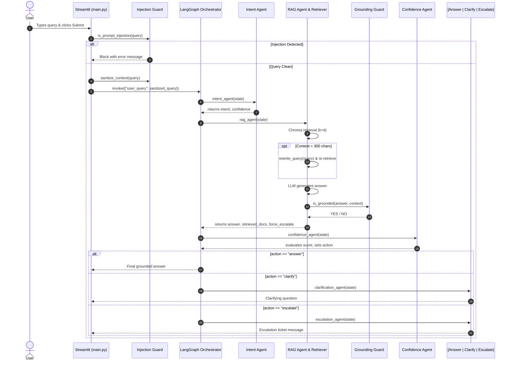
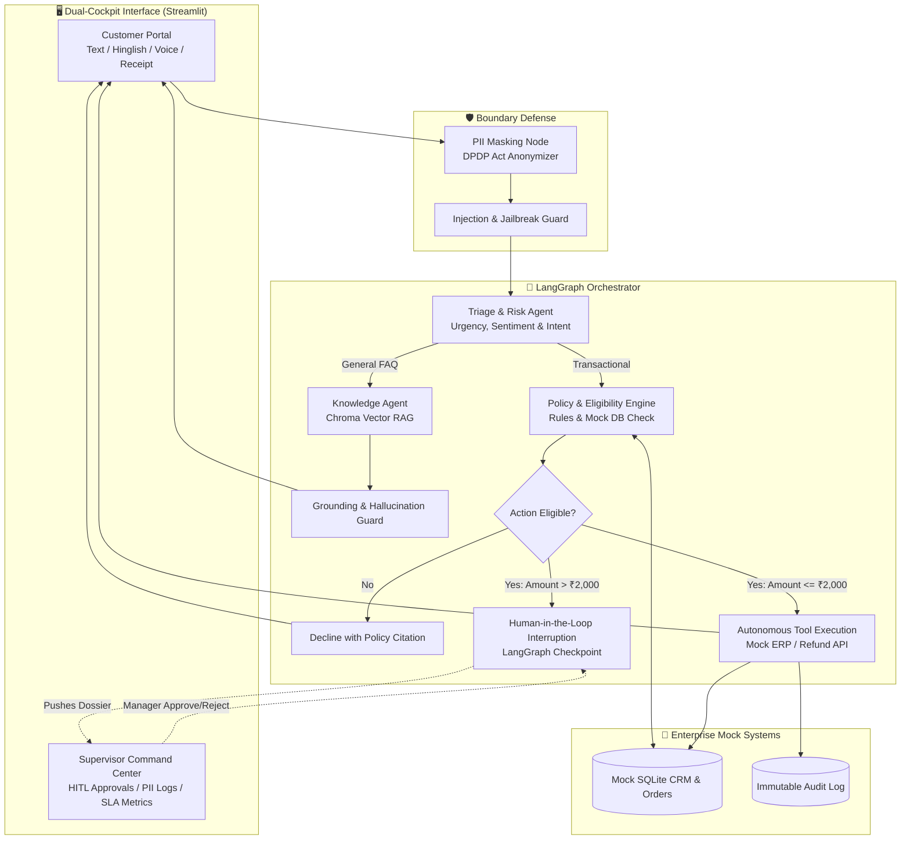

# 📘 Comprehensive System Architecture & Hackathon-Winning Blueprint
**Autonomous Multi-Agent Customer Support System**  
*Domain: Agentic AI · Orchestration: LangGraph · Retrieval: Chroma RAG · Framework: Streamlit*

---

## 📑 Table of Contents
1. [Executive Summary & Current Project Capabilities](#1-executive-summary--current-project-capabilities)
2. [Complete Project Structure & File-by-File Breakdown](#2-complete-project-structure--file-by-file-breakdown)
3. [Deep-Dive: How the Current System Works](#3-deep-dive-how-the-current-system-works)
4. [Identified Bugs & Technical Gaps in Current Code](#4-identified-bugs--technical-gaps-in-current-code)
5. [Evaluation of Features from the Reference Sheet](#5-evaluation-of-features-from-the-reference-sheet)
6. [Winning Additions & Novel Architecture Ideas](#6-winning-additions--novel-architecture-ideas)
7. [Target Architecture (The Winning System)](#7-target-architecture-the-winning-system)
8. [Step-by-Step Hackathon Execution Roadmap](#8-step-by-step-hackathon-execution-roadmap)
9. [3-Minute Live Hackathon Pitch Script & Defense Strategy](#9-3-minute-live-hackathon-pitch-script--defense-strategy)

---

## 1. Executive Summary & Current Project Capabilities

### What the Project Is
The current project is a **deterministic, multi-agent customer support prototype** designed to answer customer service inquiries using **LangGraph** for workflow orchestration, **ChromaDB** for knowledge retrieval (RAG), **Groq (OpenAI OSS 20B / LLaMA)** for reasoning, and **Streamlit** for the frontend user interface.

### Core Value Proposition (As Currently Implemented)
* **Controlled Agent Flow**: Avoids unconstrained LLM loops by enforcing deterministic routing in Python.
* **Domain Knowledge Grounding**: Answers are constrained to a curated knowledge base of markdown documents covering billing, logins, refunds, and subscriptions.
* **Pre-Execution Guardrails**: Basic prompt-injection filtering and post-generation hallucination detection.
* **Confidence-Based Routing**: Queries are graded to determine whether to output an answer, request clarification, or escalate to human support.
* **Evaluation Framework**: Includes a 52-sample test dataset (`evaluation.json`) and a Jupyter Notebook (`evaluation.ipynb`) for measuring routing accuracy, hallucination rates, and confidence calibration.

---

## 2. Complete Project Structure & File-by-File Breakdown

```
Langgraph-Customer-Support-Multi-Agent-main/
│
├── .env                                # Environment variables (GROQ_API_KEY)
├── requirements.txt                    # Project dependencies
├── config.py                           # Central configuration (LLM, directories, model params)
├── main.py                             # Streamlit UI & entry point for user queries
├── README.md                           # Project documentation & claimed architecture
├── evaluation.ipynb                    # Evaluation benchmark notebook
│
├── core/                               # Orchestration Core
│   ├── __init__.py
│   ├── state.py                        # SupportState TypedDict defining the shared graph memory
│   └── graph.py                        # LangGraph StateGraph assembly and compilation
│
├── agents/                             # Agent & Guardrail Nodes
│   ├── __init__.py
│   ├── intent_agent.py                 # Intent classification node (billing, refunds, etc.)
│   ├── rag_agent.py                    # Document retriever, query rewriter, answer generator
│   ├── confidence_agent.py             # Answer quality evaluator, tone controller, action router
│   ├── clarification_agent.py          # Formulates follow-up questions for ambiguous queries
│   ├── escalation_agent.py             # Formulates human support handoff notices
│   ├── grounding_guard.py              # LLM-based hallucination detection against retrieved context
│   └── injection_guard.py              # Keyword-based prompt injection detection & sanitization
│
├── rag/                                # Retrieval Layer
│   ├── __init__.py
│   └── retriever.py                    # ChromaDB vector store loader & HuggingFace embeddings
│
├── data/                               # Domain Knowledge Base
│   └── docs/                           # Structured Markdown FAQs (Problem, Solution, Notes, Keywords)
│       ├── billing/                    # 20 docs (e.g., upi_payment_issues.md, card_charged_twice.md)
│       ├── login/                      # Login & authentication troubleshooting docs
│       ├── refunds/                    # 20 docs (e.g., refund_eligibility.md, chargeback_initiated.md)
│       └── subscription/               # Plan cancellation, upgrade, and downgrade policies
│
├── evaluation/
│   └── evaluation.json                 # 52 labeled test samples (queries, expected actions, reference docs)
│
├── chroma_db/                          # Persistent Chroma vector store index files
└── venv/                               # Python 3.11 Virtual Environment
```

### Detailed File Responsibilities

#### Root Configuration & Entry
* **[`config.py`](file:///d:/VIT%20hack/Langgraph-Customer-Support-Multi-Agent-main/config.py)**:
  Loads `.env`, sets `BASE_DIR`, `CHROMA_DIR = "chroma_db"`, and initializes `ChatGroq` with `model = "openai/gpt-oss-20b"` (temperature: `0.2`).
* **[`main.py`](file:///d:/VIT%20hack/Langgraph-Customer-Support-Multi-Agent-main/main.py)**:
  Streamlit UI. Renders a single `st.text_area` for user input, triggers `is_prompt_injection()`, runs `sanitize_context()`, invokes the LangGraph instance via `run_support_query()`, and displays the response, confidence metric, and escalation warning. Wrapped in `@traceable` for LangSmith observability.
* **[`requirements.txt`](file:///d:/VIT%20hack/Langgraph-Customer-Support-Multi-Agent-main/requirements.txt)**:
  Specifies core libraries: `streamlit`, `langchain`, `langchain_groq`, `langchain_chroma`, `sentence-transformers`, `chromadb`, `unstructured`, and `langsmith`.

#### Core Orchestration (`core/`)
* **[`core/state.py`](file:///d:/VIT%20hack/Langgraph-Customer-Support-Multi-Agent-main/core/state.py)**:
  Defines `SupportState(TypedDict)`:
  * `user_query: str`
  * `intent: str`, `intent_confidence: float`
  * `retrieved_docs: List[str]`
  * `answer: str`, `answer_confidence: float`
  * `action: Literal["answer", "clarify", "escalate"]`
* **[`core/graph.py`](file:///d:/VIT%20hack/Langgraph-Customer-Support-Multi-Agent-main/core/graph.py)**:
  Constructs the LangGraph `StateGraph(SupportState)`. Registers 5 nodes: `intent`, `rag`, `confidence`, `clarify`, `escalate`. Defines edges: `intent -> rag -> confidence` and conditional edge from `confidence` based on `s["action"]`.

#### Agents & Guardrails (`agents/`)
* **[`agents/intent_agent.py`](file:///d:/VIT%20hack/Langgraph-Customer-Support-Multi-Agent-main/agents/intent_agent.py)**:
  Prompts LLM to classify query into: `billing`, `login`, `subscription`, `refunds`, or `unknown`.
* **[`agents/rag_agent.py`](file:///d:/VIT%20hack/Langgraph-Customer-Support-Multi-Agent-main/agents/rag_agent.py)**:
  Retrieves top-4 chunks from Chroma. If total context < 300 characters, calls `rewrite_query()` and retries. Generates answer using context. Runs `is_grounded()`. If ungrounded or context still insufficient, flags `force_escalate: True`.
* **[`agents/grounding_guard.py`](file:///d:/VIT%20hack/Langgraph-Customer-Support-Multi-Agent-main/agents/grounding_guard.py)**:
  Sub-agent prompt asking whether every factual claim in the answer is supported by context (returns strict `YES` or `NO`).
* **[`agents/confidence_agent.py`](file:///d:/VIT%20hack/Langgraph-Customer-Support-Multi-Agent-main/agents/confidence_agent.py)**:
  Prompts LLM to score answer quality from 0.0 to 1.0. Applies tone adjustment if score < 0.65. Determines `action` (`answer`, `clarify`, `escalate`).
* **[`agents/clarification_agent.py`](file:///d:/VIT%20hack/Langgraph-Customer-Support-Multi-Agent-main/agents/clarification_agent.py)**:
  Generates a clarifying follow-up question when the user query is ambiguous.
* **[`agents/escalation_agent.py`](file:///d:/VIT%20hack/Langgraph-Customer-Support-Multi-Agent-main/agents/escalation_agent.py)**:
  Returns a human escalation message: *"Your issue requires human assistance. A support ticket has been created."*
* **[`agents/injection_guard.py`](file:///d:/VIT%20hack/Langgraph-Customer-Support-Multi-Agent-main/agents/injection_guard.py)**:
  Pattern-based check matching strings like `"ignore previous instructions"`, `"system prompt"`, `"bypass"`. Sanitizes words like `"ignore"`, `"override"`, `"system:"`.

#### Knowledge Base & Vector Store (`rag/` & `data/`)
* **[`rag/retriever.py`](file:///d:/VIT%20hack/Langgraph-Customer-Support-Multi-Agent-main/rag/retriever.py)**:
  Loads `sentence-transformers/all-MiniLM-L6-v2` embeddings, attaches to persistent Chroma store at `chroma_db/`, and exposes a retriever with `k=4`. Cached via `@st.cache_resource`.
* **[`data/docs/`](file:///d:/VIT%20hack/Langgraph-Customer-Support-Multi-Agent-main/data/docs)**:
  80+ Markdown knowledge documents split into 4 categories (`billing`, `login`, `refunds`, `subscription`). Each document has metadata sections:
  `Category`, `Problem`, `Solution`, `Notes`, `Keywords`.

---

## 3. Deep-Dive: How the Current System Works

### End-to-End Execution Flow



### LangGraph State Transition Details
1. **Entry**: Graph initializes `SupportState` with `user_query`.
2. **Node 1 (`intent`)**: LLM categorizes query; sets `intent` and `intent_confidence`.
3. **Node 2 (`rag`)**: Queries vector store; verifies context sufficiency (> 300 chars); LLM drafts answer; `is_grounded` tests factual fidelity.
4. **Node 3 (`confidence`)**: LLM assigns a score (0 to 1). Sets `action: "answer" | "clarify" | "escalate"`.
5. **Conditional Branch**:
   * If `action == "answer"`: Routes directly to `END`.
   * If `action == "clarify"`: Routes to `clarify` node, which rewrites `answer` with a clarifying question, then terminates.
   * If `action == "escalate"`: Routes to `escalate` node, which rewrites `answer` with a ticket creation notice, then terminates.

---

## 4. Identified Bugs & Technical Gaps in Current Code

Before pitching or presenting, you must be aware of these flaws in the existing implementation:

1. **The Overwrite Bug in [`agents/confidence_agent.py`](file:///d:/VIT%20hack/Langgraph-Customer-Support-Multi-Agent-main/agents/confidence_agent.py#L37-L44)**:
   ```python
   if score > 0.65:
       action = "answer"
   if score < 0.4:
       action = "escalate"
   else:
       action = "clarify"  # <-- BUG: Overwrites "answer" on ANY score >= 0.4!
   ```
   *Impact*: An answer with a confidence score of 0.95 is marked `"answer"`, and then immediately overwritten to `"clarify"`. The system will almost never output `"answer"`.
2. **Intent Agent Output is Dead Code**:
   *Impact*: `intent` and `intent_confidence` are extracted in `intent_agent.py`, but neither `rag_agent` nor `core/graph.py` ever reads them. RAG searches all documents without filtering by intent.
3. **Missing State Field**:
   `rag_agent.py` returns `"force_escalate": True`, but `force_escalate` was omitted from `SupportState(TypedDict)` in `core/state.py`.
4. **Lack of Conversational Memory**:
   `main.py` is single-turn (`st.text_area`). When `clarification_agent` asks a question, the user has no way to respond back in the same conversation thread.
5. **No True Tool Execution**:
   The system cannot perform actions (e.g., look up an account balance, issue a refund, or reset credentials).

---

## 5. Evaluation of Features from the Reference Sheet

Reviewing the 10 features from your reference sheet against **National-Level Hackathon Criteria** (Technical Innovation, Real-World Feasibility, Agentic Autonomy, Demo Wow-Factor):

| # | Feature Name | Hackathon Priority | Verdict & Strategic Role |
|---|---|---|---|
| **1** | **Priority and Risk Ranking** | ⭐⭐⭐⭐ **High Value (Tier 2)** | **Must Implement.** Demonstrates intelligent triage. Computes urgency (Low/Med/High/Critical) and assigns an SLA clock. Highly visual in the demo. |
| **2** | **Context-Preserving Human Handoff** | ⭐⭐⭐⭐⭐ **Crucial (Tier 1)** | **Showstopper Feature.** When escalating, the agent auto-generates a structured "Handoff Dossier" (Issue Summary, Customer Frustration Level, Tool Execution History, Unanswered Questions). Judges love this because it solves the #1 customer pain point: having to repeat yourself to human reps. |
| **3** | **Evidence-Backed Answers** | ⭐⭐⭐ **Medium Value** | Standard RAG practice. Enhance current retrieval by displaying exact document names, chunk dates, and confidence badges. |
| **4** | **Duplicate-Case Detection** | ⭐⭐⭐ **Medium Value** | Good concept, but hard to demo in a fast 3-minute pitch unless backed by a pre-loaded mock CRM showing duplicate ticket merging. |
| **5** | **Customer Sentiment & Distress Detection** | ⭐⭐⭐⭐ **High Value (Tier 2)** | High ROI. Sentiment analysis triggers adaptive tone shifting and auto-escalation for frustrated/churn-risk customers. |
| **6** | **Action Eligibility Checker** | ⭐⭐⭐⭐⭐ **Crucial (Tier 1)** | **The Core of "Agency".** Validates business rules (e.g. 14-day refund window, account verification) against a mock database before executing or rejecting an action. |
| **7** | **Multilingual & Code-Mixed Support (Hinglish)** | ⭐⭐⭐⭐⭐ **Crucial (Tier 1)** | **National Hackathon Differentiator.** Crucial for Indian hackathons. Handling mixed language queries (e.g., *"Mera payment cut ho gaya par subscription active nahi hui"*) will immediately outshine English-only projects. |
| **8** | **Proactive Incident Communication** | ⭐⭐ **Omit / Future Scope** | Hard to demo live in a 3-minute pitch. Requires background cron jobs and mass alert simulations. Mention as "Future Roadmap". |
| **9** | **Privacy & PII Protection Layer** | ⭐⭐⭐⭐ **High Value (Tier 2)** | High enterprise relevance. Aligns with India's **DPDP Act (2023)** and GDPR. Masks phone numbers, emails, credit cards, and OTPs before sending data to external LLMs. |
| **10** | **Resolution-Quality & Follow-Up Agent** | ⭐⭐ **Omit / Future Scope** | Real-world follow-ups occur hours or days after resolution. Impossible to demo naturally in a live presentation. Mention on your final slides. |

---

## 6. Winning Additions & Novel Architecture Ideas

To stand out from typical chatbot entries and compete for top prizes, incorporate these **4 structural upgrades**:

### Idea 1: The "Dual-Cockpit" Streamlit UI (Demo Supercharger)
Do not present a simple chatbot box. Split the Streamlit interface into two live tabs:
* **Tab 1: Customer Portal**: Modern chat widget (`st.chat_message`) with Hinglish support and file/receipt upload.
* **Tab 2: Operations Center / Agent NOC**:
  * Live SLA countdown meters.
  * Real-time PII anonymization feed (`[REDACTED: Phone +91-98765...]`).
  * **Interactive Human-in-the-Loop (HITL) Queue**: Shows pending requests requiring manager approval (e.g., refunds > ₹2,000) with 1-click **[Approve]** and **[Reject]** buttons.

### Idea 2: Deterministic Policy Engine (Code Rules vs. LLM "Vibes")
* Pitch this architectural principle: **"LLMs reason; deterministic Python code governs."**
* Even if an adversarial prompt convinces the LLM to say *"I approve your ₹1,00,000 refund"*, the Python-level policy gate intercepts the action:
  * Order purchase date > 14 days? ➔ Auto-reject with exact policy quote.
  * Refund amount > ₹2,000? ➔ Trigger Human-in-the-Loop interrupt.
  * User unverified? ➔ Block financial tools.

### Idea 3: Multimodal Receipt & Invoice Scanner
* Add an image uploader in the customer chat.
* A vision agent extracts the Order ID, transaction date, and amount from an uploaded invoice or bank receipt image.
* Verifies whether the extracted receipt matches the customer's claim in the mock database.

### Idea 4: Full Multi-Turn Memory & State Persistence
* Replace the single-turn `main.py` with LangGraph's native `MemorySaver` checkpointer.
* Enables persistent `thread_id` sessions. When the `clarification_agent` asks: *"Did you pay via UPI or Credit Card?"*, the user can reply *"UPI"*, and the agent resumes with full context.

---

## 7. Target Architecture (The Winning System)



### Enhanced State Definition (`SupportState`)
```python
from typing import TypedDict, Literal, List, Optional, Dict, Any

class EnhancedSupportState(TypedDict):
    # Session
    session_id: str
    user_id: str
    language: str                        # "en", "hi", "hinglish"
    
    # Customer Query & PII
    raw_query: str
    sanitized_query: str
    redacted_pii: Dict[str, str]         # {"phone": "XXXXX-9821"}
    
    # Triage & Sentiment
    intent: str                          # "refund", "billing_error", "faq"
    sentiment: str                       # "positive", "frustrated", "abusive"
    priority: Literal["Low", "Medium", "High", "Critical"]
    
    # RAG & Verification
    retrieved_docs: List[Dict[str, str]]
    is_grounded: bool
    
    # Tool Execution & Action
    target_order_id: Optional[str]
    proposed_action: Optional[str]       # "refund", "subscription_cancel"
    action_amount: Optional[float]
    action_eligible: bool
    eligibility_reason: str
    
    # Human-in-the-Loop
    requires_human_approval: bool
    approval_status: Optional[Literal["pending", "approved", "rejected"]]
    handoff_dossier: Optional[Dict[str, Any]]
    
    # Output
    final_response: str
```

---

## 8. Step-by-Step Hackathon Execution Roadmap

To convert the current codebase into this winning state efficiently:

### Phase 1: Core Clean-up & Bug Fixing (Est: 45 Mins)
1. Fix the confidence routing bug in [`agents/confidence_agent.py`](file:///d:/VIT%20hack/Langgraph-Customer-Support-Multi-Agent-main/agents/confidence_agent.py) (replace the broken `if/else` ladder with a proper `elif` structure).
2. Wire `intent` and `intent_confidence` from [`agents/intent_agent.py`](file:///d:/VIT%20hack/Langgraph-Customer-Support-Multi-Agent-main/agents/intent_agent.py) into graph routing decisions.
3. Add `force_escalate` to `SupportState` in [`core/state.py`](file:///d:/VIT%20hack/Langgraph-Customer-Support-Multi-Agent-main/core/state.py).

### Phase 2: Mock Enterprise Backend & Tool Calling (Est: 1.5 Hours)
1. Create a simple mock database module (`utils/mock_db.py`) using SQLite or in-memory dictionaries:
   * Users: `{"user_id": "U101", "name": "Rahul Verma", "phone": "9876543210"}`
   * Orders: `{"order_id": "ORD-501", "user_id": "U101", "amount": 1499.0, "date": "2026-09-25", "status": "delivered", "eligible_for_refund": True}`
2. Implement 3 deterministic Python tools:
   * `lookup_order(order_id)`
   * `check_refund_policy(order_id)` (checks 14-day delivery rule)
   * `execute_refund(order_id, amount, reason)`

### Phase 3: PII Masking & Code-Mixed (Hinglish) Support (Est: 1 Hour)
1. Upgrade [`agents/injection_guard.py`](file:///d:/VIT%20hack/Langgraph-Customer-Support-Multi-Agent-main/agents/injection_guard.py) to include regex-based PII masking for Indian phone numbers (`+91 / 10-digits`), Aadhaar-like numbers, and email addresses.
2. In the system prompt of [`agents/intent_agent.py`](file:///d:/VIT%20hack/Langgraph-Customer-Support-Multi-Agent-main/agents/intent_agent.py) and [`agents/rag_agent.py`](file:///d:/VIT%20hack/Langgraph-Customer-Support-Multi-Agent-main/agents/rag_agent.py), add instructions to accept Hinglish input and respond in conversational Hinglish/English based on customer preference.

### Phase 4: Dual-Cockpit UI with Streamlit Chat & HITL (Est: 2 Hours)
1. Rewrite [`main.py`](file:///d:/VIT%20hack/Langgraph-Customer-Support-Multi-Agent-main/main.py):
   * Switch from `st.text_area` to `st.chat_message` and `st.chat_input`.
   * Add two tabs: `st.tabs(["💬 Customer Support Portal", "🛡️ Supervisor Command Center"])`.
2. In the **Supervisor Tab**, display:
   * Real-time metrics: Active Tickets, PII Redaction Count, Priority Distribution.
   * **Approval Queue**: When a refund > ₹2,000 is proposed, render an approval card showing the customer's handoff dossier and `[Approve]` / `[Reject]` buttons.

---

## 9. 3-Minute Live Hackathon Pitch Script & Defense Strategy

### The 3-Minute Live Demo Pitch

* **Minute 1: The Problem & Live Customer Demo**
  > *"Judges, enterprise customer support today is broken. Generative AI chatbots hallucinate policies, leak sensitive customer PII, and cannot safely take action in company databases.  
  > Meet our Autonomous Multi-Agent Customer Support Orchestrator.  
  > Watch as I type a complaint in Hinglish: 'Bhai mera order ORD-501 ka amount deduct ho gaya par parcel nahi mila, refund chahiye'."*
* **Minute 2: The Agentic Workflow & Safety Inspection**
  > *(Show Streamlit execution stepper)*  
  > *"Notice what just happened across our multi-agent graph:  
  > 1. Our PII Guard masked the customer's phone number before any LLM API call.  
  > 2. Our Triage Agent detected High Urgency and classified the intent as a Billing Dispute.  
  > 3. Instead of hallucinating, our Policy Agent queried the mock database, verified that order ORD-501 is within the 14-day window, and autonomously processed a refund of ₹1,499."*
* **Minute 3: The Human-in-the-Loop Enterprise Climax**
  > *"Now watch what happens when a customer requests a high-risk ₹15,000 refund or triggers an abusive query.  
  > The system doesn't guess. It triggers a LangGraph state interrupt and compiles an Executive Handoff Dossier.  
  > Switching to our live Supervisor Command Center (Tab 2)... the support lead sees the exact customer sentiment, evidence retrieved, and the agent's proposed action. With one click on [Approve], the transaction completes.  
  > We combine LLM intelligence with deterministic software safety."*

### How to Answer Typical Tough Judge Questions

| Question | Winning Response |
|---|---|
| *"Isn't this just a standard RAG chatbot?"* | *"No. RAG only reads information. Our system is an autonomous agent with action space: it queries real order APIs, enforces deterministic business policies in Python, and executes transactions. RAG is merely one sub-agent in our orchestrator."* |
| *"What happens if the LLM hallucinates an approval for an ineligible user?"* | *"Our LLMs never have execution authority. Even if the LLM says 'You get a free refund', our deterministic Policy Gate validates the order timestamp against the company return window. If the policy check fails, the tool call is blocked in Python."* |
| *"How do you handle Indian data privacy laws?"* | *"We built an upfront PII anonymization layer aligned with India's DPDP Act (2023). Phone numbers, emails, and account identifiers are masked locally before tokens are sent to any cloud LLM."* |

---
*Document generated for project: `Langgraph-Customer-Support-Multi-Agent-main`*  
*Ready for reference, development, and hackathon presentation.*
